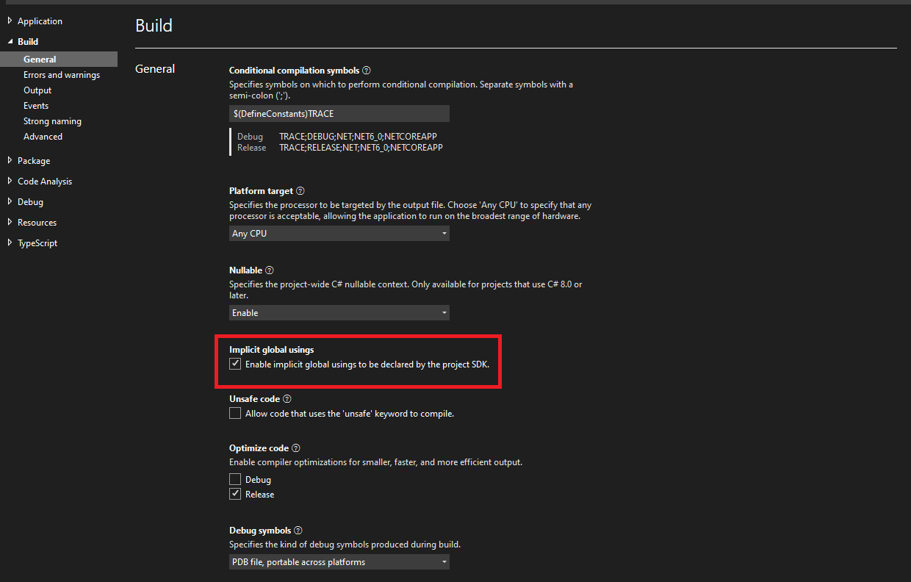
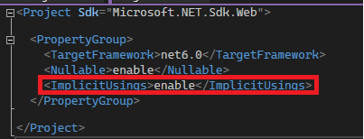
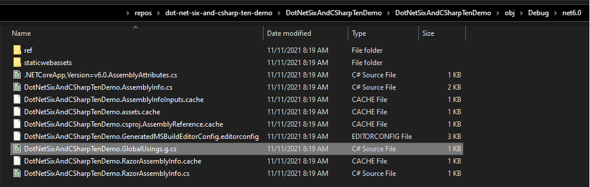

# Global and implicit using directives

When working with C#, we used `using` keywords in two different places. One is at the beginning of C# files. This is called `using` directive. The `using` directive enables us to use the types defined in a namespace without referring to the type by fully qualified namespace when using that type. For example, to use `Console`, you could either use `System.Console`(the fully qualified namespace) or you could use a `using` directive at the beginning of the file and use `Console` wherever you need in the file.

```csharp
//with fully qualified namespace
public class Program
{
    public static void Main()
    {
        System.Console.WriteLine("Hello World");
    }
}
```

```csharp
//With using directive
using System;

public class Program
{
    public static void Main()
    {
        Console.WriteLine("Hello World");
    }
}
```

The other is called `using` statement. The `using` statement is used to call the `Dispose` method of a type that implements the `IDisposable`. `IDisposable` is used to release unmanaged resources.

> The garbage collector automatically releases the memory allocated to a managed object when that object is no longer used. However, it is not possible to predict when garbage collection will occur. Furthermore, the garbage collector has no knowledge of unmanaged resources such as window handles, or open files and streams.
> Use the `Dispose` method of this interface to explicitly release unmanaged resources in conjunction with the garbage collector. The consumer of an object can call this method when the object is no longer needed. - [IDisposable Interface](https://docs.microsoft.com/en-us/dotnet/api/system.idisposable#remarks)

```csharp
//Before C# 8
using var file = new StreamWriter("fileName.txt", append: true)
{
    await file.WriteLineAsync("new line");
}
```

```csharp
//After C# 8
using var file = new StreamWriter("fileName.txt", append: true);
await file.WriteLineAsync("new line");
```

In C# 10 and .Net 6, there are a couple of changes to the `using` directives. Let's discuss what they are.

## Global using directives

From C# 10, adding a `global` keyword in front of the using directive enable us to use types from that namespace anywhere of our project without adding them to each file where we use them.

> The `global` modifier has the same effect as adding the same `using` directive to every source file in your project. This modifier was introduced in C# 10. - [using directive](https://docs.microsoft.com/en-us/dotnet/csharp/language-reference/keywords/using-directive)

With this change, the new convention is to create a C# file named `GlobalUsings` in the project and move the using statements to the `GlobalUsings.cs` file and prefix the using statement with the `global` keyword. Then these namespaces will be available for your classes globally.

```csharp
global using System;
global using System.Collections.Generic;
global using System.Linq;
```

Please note file which contains the `global using`s could be called anything. But I assume a lot of people will use the name `GlobalUsings`.

At the time of writing, Visual Studio 2022 doesn't allow you to move the `global using`s to a file that contains `global using`s with any refactoring actions. This needs to be done by hand. But if your `global using`s file contains any namespaces which are not used, you could use the code clean up feature in Visual Studio to remove the unused `global using`s.

## Implicit using **directives**

Implicit `global using` directives are a set of `global using` directives added to the project when creating a new .Net 6 project. Implicit using are enabled by default in .NET 6. Implicit `global using` directives are not added to existing projects when retargeted to .Net 6 or later.

> In .NET 6 RC 1 and later versions, implicit `global using` directives are only added for new C# projects. They are disabled for existing projects, and some of the associated MSBuild property and item names have changed from Preview 7. - [Implicit global using directives for new C# projects only](https://docs.microsoft.com/en-us/dotnet/core/compatibility/sdk/6.0/implicit-namespaces-rc1)
> Starting in .NET 6 RC 1, no implicit `global using` directives are added when you retarget an *existing* project to .NET 6 or later. (They are still added for new C# projects that target .NET 6.) However, you can enable the feature in your existing C# project by setting the [ImplicitUsings MSBuild property](https://docs.microsoft.com/en-us/dotnet/core/project-sdk/msbuild-props#implicitusings) to `true` or `enable`. - [Implicit global using directives for new C# projects only](https://docs.microsoft.com/en-us/dotnet/core/compatibility/sdk/6.0/implicit-namespaces-rc1#new-behavior)

You can enable the implicit `using` statements in your project using one of these.

1. (Right-click on the Project → Properties) or Select the Project and `Alt + Enter`

    

2. Go to the `.csproj` file and add `<ImplicitUsings>enable</ImplicitUsings>` to `PropertyGroup`

    

You can see the GlobalUsings file by going to the Project folder → obj → Debug → net6.0 folder.



Thanks for reading.

## Credits

- [Preview-to-preview breaking change: Implicit `global using` directives disabled for existing projects - .NET](https://docs.microsoft.com/en-us/dotnet/core/compatibility/sdk/6.0/implicit-namespaces-rc1)
- [using directive - C# Reference](https://docs.microsoft.com/en-us/dotnet/csharp/language-reference/keywords/using-directive)
- [using statement - C# Reference](https://docs.microsoft.com/en-us/dotnet/csharp/language-reference/keywords/using-statement)
