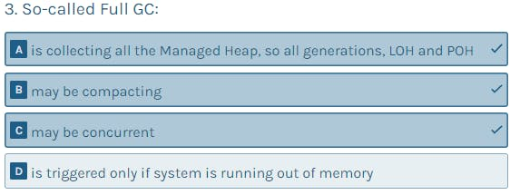

# .Net memory management quiz by Dotnetos

To access the quiz please go to [Evaluate your .NET memory management knowledge](https://quiz.dotnetmemoryexpert.com/)

## Questions

- Question 1

  

  There are few reasons why GC is being triggered. But by far most common one is when you allocate an object and (roughly speaking) there is no enough space for it. Thus, **if you don't allocate - there is a little chance GC will happen at all**. That's why you will meet the trend of "zero alloc"-code. It has good performance not only because it does not allocate (which is a performance benefit by its own) but also greatly
  reduces the chance of the GC and its overhead. And **being aware of and avoiding allocations is one of the most important "memory-aware", performant code in general**.

  Other, less common, trigger is when an operating system notices the shortage of available memory. It broadcasts then so-called "low-memory notification" and various programs may react to it (or ignore it). .NET runtime reacts by triggering GC and also switching into "low-memory mode" which makes it more aggressive in reclaiming memory.

  Obviously, **GC.Collect** call may (or may not, depending on its parameters) trigger GC. But calls to it are pretty rare and in general should be omitted.

  However, there is no such thing as "time-based" triggering of the GC (like in answer A). There are other less common triggers too, but let's not deep it into too much.

- Question 2

  

  Blazor WebAssembly, as at the times of .NET 5, **is running on Mono** (originally written in C) but compiled into WebAssembly. Thus, as a completely different runtime, **it has different GC** too. Although, things may change in future because Mono is intensively developed and actively experimenting (for example, in using the "main" .NET GC). And the whole unification of Mono and .NET runtimes may help here, too.

- Question 3

  

  By Full-GC we understand the GC
  **collecting everything** (as the name suggests). Thus, it is indeed collecting all generations in SOH, as well as LOH and POH (added recently in .NET 5). That's why it should be also perceived as by far the most "expensive" one in terms of memory and
  CPU utilization. **In well-behaving application it should happen noticeably less often than faster Gen0 and Gen1 GCs**.

  There is currently at least one practical implication of the Full GC characteristics. It may be concurrent or compacting but not both at the same time. Concurrent (called Background) Full GC is

  **the most common** and preferred one as it introduces only short pauses, thus not influencing application behaviour a lot. But as it is not compacting, it results in fragmentation - free space that not always may be reused (although GC does a lot to reuse
  it). So, if fragmentation will become severe, compacting Full GC may be triggered that can introduce long pauses (as it is not concurrent) or a process will grow in size as it had a memory leak if no compacting GC is triggered.

- Question 4

  

  By  *"mid-life"* crisis we understand violation of the so-called **generational hypotheses** around which all generational GCs (including .NET one) are built upon. They state that **most of the objects are dying young**, and that there is smaller group of objects living long (in other words: "*If an object is young, it probably will die soon. If it lives long, it will probably live even longer"*).

  That's why *"object living long-enough to be treated as 'old' and then dying"* is violating this rule and *"mid-life crisis"* is a good name for it! It negatively impacts the GC behaviour, which is tuned for something opposite. They are trying to collect *"young generations"* frequently, and *"old generations"* much less often. Introducing *"mid-life crisis"* is one of the most common problems in .NET memory which incurs higher CPU usage and/or pauses overhead.

- Question 5

  

  Size limits of .NET application are the same as limits of every process, limited by the virtual address space - the amount of memory that can be addressed with a given bitness of an application. And while the vast majority of operating systems are 64-bit nowadays, we can still compile/run our programs as either 32- or 64-bit. The same applies for the .NET runtime executing our .NET application.

  32-bit pointer can address 4GB of memory, but by default half of it is dedicated to the Windows operating system and half for the application itself.

  **Thus, 2GB is a default limit here**. However, in case of 64-bit Windows, **we can run 32-bit applications in so-called “Large Address Aware” mode**, which allows to address more - around 3 GB. This flag is, for example, used when hosting 32-bit [ASP.NET](http://asp.net/) Framework applications inside IIS. In case of Linux similar limits are happening. Thus, without going into too much details, around 2 or 3GB is a limit for 32-bit .NET application.

  64-bit pointer can address 16EB (exabytes!) of memory which is just insane amount. That’s why nowadays **most hardware is using only 48-bits to address
  upper and lower 128TB of the whole address space** (for the operating system and application). And this is the limit we see for .NET applications too.

- Question 6

  

  Large Object Heap is a dedicated part of the Managed Heap for “big objects”. Since the very beginning of .NET, the default threshold to treat object as “big” is 85000 bytes. Recently [a possibility to increase this limit has been added](https://docs.microsoft.com/en-us/dotnet/core/run-time-config/garbage-collector#large-object-heap-threshold). **Every object bigger than this threshold is allocated in LOH and stays there until garbage collected**.

  LOH was designed as a space separated from SOH because **“big” objects have different characteristics** - they are big, so creating and moving them (compacting) memory may incur a lot of memory traffic. As it is expected to not have and create many such objects, **the allocation cost there is bigger** (including clearing the memory and some multi-threaded synchronization overhead). And because there is no different way of cleaning LOH than using Full GC, if you allocate there often and put a memory pressure on it, **you may trigger costly Full GCs**.

- Question 7

  

  *dotnet trace* is one of the multiplatform command line (CLI) tools for diagnostics added in .NET Core ecosystem to collect **various “diagnostic traces” of a .NET process**. Both on Windows and Linux you can use there three predefined profiles:
  - *cpu-sampling* - sampling CPU profiler to observe the CPU usage
  - *gc-collect* - very low overhead tracking of the high-level GC collections data
  - *gc-verbose* - as above plus rough sampling of object allocations Created trace may be then opened in Visual Studio or PerfView tool.

- Question 8

  

  *dotnet gcdump* is another one multiplatform diagnostics tool added in .NET Core ecosystem which is able to **trigger GC and record special diagnostic data emitted during it**. This allows to produce “gcdump” - not a regular memory dump containing all or part of the process memory, but “diagnostic snaphost” of the managed memory state. It includes information what managed objects were discovered and collected during the GC (**without the content of those objects**). That’s why “gcdump” is much smaller than an amount of memory consumed by the process. Such snapshot may be then analysed in Visual Studio or PerfView (including information what were the relations between objects).

- Question 9

  

  Funny fact that may be sometimes misleading when analyzing memory dumps - **every .NET process is preallocating OutOfMemoryException and StackOverflowException** instances. Just in case they are needed, which would mean that there is indeed a shortage of memory and there would be no way to create them!

  Additionally, some **object[] arrays are preallocated in LOH** to reference objects used by "handles". This is an important mechanism used by string interning, statics and Thread-local statics. So, for example, even if you don't use LOH at all, you will see some arrays there referencing your static objects.

- Question 10

  

  Every GC run in .NET has some shorter or longer phases when it expects the runtime will "suspend" the application. Those pauses are also known as "stop the world" phases. And in general **they are obviously undesirable as they influence the application responsiveness and performance**. A lot of .NET GC improvements are going on to make those pauses as short as possible.

  So, "stop the world" is a pause for the time of doing GC (or part of it) when all managed threads are "paused". For example, this makes possible to take a consistent view of which managed objects are being used. Unmanaged threads are not suspended as there is no need for it - by default they are not accessing managed objects and if even so, they are accessing "pinned" objects treated in a special way.

- Question 11

  

  Concurrent GC, also known as Background GC, is the one that **most of the time works concurrently with the managed threads**, not introducing long "stop the world" pauses. It does not mean no pauses are introduced at all. It requires at least two pauses - at the beginning and somewhere in the middle - to get some consistent view of the memory state.

  Moreover, current .NET GC implementation is **not able to compact memory while the application is running**. Thus, both Full GC, or even Gen0 or Gen1 GC, must work in "stop the world" mode if they want to compact memory.

  Work on introducing concurrent compacting GC is for sure ongoing and sooner or later we may expect adding it to .NET ecosystem. There are such implementations used with success, for example in JVM ecosystem. Still, they have they own drawbacks and trade-offs
  as nothing comes for free.

- Question 12

  

  To have a good high-level view of your .NET program's memory consumption it is best to know at least three measurements. First, **how much memory is committed** to your program in overall ("private bytes") and **how much of it is consumed physically in RAM** ("working set") - this will allow you to notice a lot of memory being paged/swapped to disk too. Obviously in .NET context, it is great to know **what is the memory consumption of the Managed Heap**.

  On the other hand, virtual address space covers the whole address space that could be used by our application and it is not related to its behaviour.

- Question 13

  

  In .NET, there are APIs available to have some control over GC behaviour. For example, *GC.Collect* and its overloads allows us to trigger Gen0, Gen1 or Full GC (specifying whether you want to make it blocking and/or compacting). However, due how .NET GC works, we cannot trigger collecting only generation 2 or LOH.

  **When collecting a given generation (or LOH) always all younger generations are garbage collected too**. So when we trigger collecting Gen 2, we are triggering the Full GC that collects everything. And there is no API to trigger only LOH (which BTW again, would trigger the Full GC).

  Compacting Pinned Object Heap cannot be triggered by any API and obviously it cannot happen at all. The sole purpose of POH is to have a place for objects that will not move (are “pinned” by default), **so we cannot compact POH ever**.

  On the other hand, there is indeed an API that allows to trigger compacting LOH in the next upcoming non-concurrent Full GC. It is *LargeObjectHeapCompactionMode* property setting which is usually immediately followed by *GC.Collect()* call to trigger full, blocking GC:

  *GCSettings.LargeObjectHeapCompactionMode = GCLargeObjectHeapCompactionMode.CompactOnce; GC.Collect();*

- Question 14

  

  When we run .NET application, it is executed by the .NET runtime hosted inside a process. In other words, **every .NET application is executed by its own runtime instance** and there is nothing shared between them. It allows us to configure and manage lifecycle of every .NET application separately. This includes .NET GC and Managed Heap - each process has its own and does not care about the others (in fact, is not aware of the others). A GC triggered in one .NET app will not affect (nor trigger) GC in other .NET app.

  Having said that, processes running on the same machine are sharing some resources like CPU, memory and disks. On that level some resources saturation may happen, obviously.

- Question 15

  

  If you have ever hit the limit of 2GB total size of an object - probably an array or string, a good news for you is that **you can overcome it with the help of *gcAllowVeryLargeObjects* flag** (disabled by default). It allows to create arrays that are bigger than 2GB, but this applies only to arrays (so, no strings or any other object type) and only to the array’s total size. The maximum number of elements in an array (which is *UInt32.MaxValue*) does not change. And although for sure it is not the most common requirement, for example it may be useful in applications processing huge images or medical data.

- Question 16

  

  Pinned Object Heap is a new type of the Managed Heap part (beside SOH and LOH) added in .NET 5, **dedicated for objects that will not be moved by the GC**. Thus, in other words, POH will never be compacted. This allows to treat all objects in POH as “pinned” by default. This is beneficial because pinning in SOH/LOH introduces some overhead and reduces flexibility of compacting memory (which may lead to fragmentation). Having a dedicated place for “pinned” objects reduces those issues completely.

  However, **a new API has been added for allocations** because now we need to specify that we are allocating an object that is immediately required to be pinned. And while POH does not have such limitations per se, currently such API is called *GC.AllocateUninitializedArray* because we can allocate there only array of types which are not references and does not contain references (like array of bytes).

- Question 17

  

  **Finalizer** is a special method that will be **called by the runtime after some (indeterministic) time a given object has been detected as no longer reachable**. In other, simplified words, it is a special method called before an object will be garbage collected. Thus, it is **treated as a safety net for releasing some unmanaged (native) resources** for objects holding them. Typically, it is some "handle" to a file, socket or whatsoever. The preferred way is to use *IDisposable* contract and release those resources explicitly by calling *Dispose* (or with *using* clause). But if a programmer will forget to do that, finalizer may do that on her behalf. Thus, a class may need a finalizer to ensure that its underlying native resource is cleaned up.

  Finalizer, although typically living altogether with *IDisposable*, is **not related with it in any required way**. And because the order of calling finalizers in objects (even depending on each other) is not guaranteed, it is a good practice to avoid any assumed order of calling them.

- Question 18

  

  Unfortunately, currently there is **no API available that will inform about currently happening GC**. Moreover, there is even no **reliable** API that will warn us about an upcoming GC. I especially emphasize - "reliable". Indeed, there is *GC.RegisterForFullGCNotification* method which (as documentation says) raises a notification "when the runtime senses that a full garbage collection is approaching". But this "sensing" is **not accurate** and also depends on a magic threshold which should be fine-tuned to your application workload by many retries.

  **I personally treat it as legacy and I discourage using it**.

  On the other hand, there is a pretty well-known *GC.Collect* method for triggering GC and a little less known *GC.TryStartNoGCRegion* method trying to disable GC for a duration limited by a given amount of allocations.

- Question 19

  

  Managed pointer (also known as *ref* or *byref*) is a special type of pointer which **allows to point many places in memory**: stack data, inside objects or arrays or native data. And because it may point to stack data, it has pretty big limitations where we can use it. For example, currently it is forbidden to use it as a class field - because **it could outlive the address pointed to (on the stack)**. It is even forbidden to use it as a *ref struct* field (living always on the stack), although this limitation may be relaxed in the future.

  Managed pointed is pretty often used in low-level, performant code to manipulate data directly, especially in combination with *structs* and/or `Span<T>` (which is, by the way, underneath also using a managed pointer).

- Question 20

  

  Server GC is a mode dedicated to applications **processing requests simultaneously** - so, typically web applications. But with success it may be used in any other type of applications with similar characteristics (like service processing messages from a queue). The main assumed characteristic is that **we are mostly concerned about the throughput** - processing as many requests per second as possible. So, in contrary to the Workstation GC, it is not concerned so much about introduced pauses (latency), because there is no direct user (fe. interacting with UI) that will be impacted by them.

  And because we assume more "server-like" application, it is also more willing to consume more memory and CPU threads to reach its goals.

- Question 21

  

  **GC pause time** is something worth measuring, in the first place. Every such a pause may introduce unwanted delays - whether they will be pauses noticed by the UI or a longer HTTP request processing. Unfortunately, there is no big support in measuring them at the times of .NET 5. There is no dedicated **Performance Counter** (in case of .NET Framework) nor **Event Counter** (in case of .NET Core). And there is no appropriate **GC API** available either. But it does not mean we cannot measure it! The best way is to collect a trace with the help of **PerfView** or d**otnet trace CLI tool** and look at the **GC Stats report** in the PerfView.

- Question 22

  

  **Ref struct** is a special type of struct, introduced in **C# 7.2**. It puts a lot of limitations on the struct behaviour. And all of them target a single goal - disallow an instance of ref struct to even land in the **Managed Heap**.

  A regular struct may land there in many ways - it may be **explicitly** or **implicitly** boxed (for example by treating it as object or interface), or when it is a field of a class.

  All those conditions are **prohibited** for ref struct. Thanks to that, we have a **powerful feature** - it is guaranteed it will always live on the stack (or CPU registers). This limitation may be interesting by itself - **a stack-based data structure** does not require any multithreading synchronization, because it cannot be accessed by multiple threads by default. And we have a guarantee it will never put a **GC pressure**.

  But the most important result of those limitations is that it may contain a managed pointer. Or types containing a managed pointer (like `Span<T>`). Thus, it is a pretty popular type used in low-level programming taking advantage of using managed pointers.

- Question 23

  

  **Reference cycles** are in general problematic in the garbage collection algorithms using reference counting. In the naive implementations, objects forming a cyclic reference **cannot be reclaimed** because there is always at least one object pointing to another one. And there are more sophisticated reference counting algorithms with some additional overhead in handling cyclic references.

  But .NET GC is not using reference counting. It is so-called **tracing GC**, which is based on "tracing" what is really still reachable from the code. Such tracing is smart - it **visits every object only once**, even if there are complex dependencies between objects. In other words, cycles do not impact GC performance at all.

- Question 24

  

  **ValueTask** is a struct. So, by using it we benefit with the possibility that it will not be allocated on the **Managed Heap**. It may happen in a "happy", synchronous path of an async operation - we know the result already, so **we can pass it via struct**, instead of allocating a Task just to say what the result is. However, we cannot say it will never be boxed because in a "not happy" asynchronous path, it may be boxed inside a state machine keeping track of the operation.

- Question 25

  

  **String interning** is a technique to not duplicate instances of strings with the same value known at compile time. Thus, every time you use a string literal like "Hello world!" in various places in your C# code (within the same project/assembly), compiler will **recognize** that and treat as a single '**interned string**'. Such interned strings are just regular strings allocated on the ManagedHeap. The only difference is that JIT knows about them so when compiling IL code referring to them, it will reuse already allocated string, instead of creating a new one with the same value. Thus, if you sometimes hear about "**String
  Intern Pool**", it is a pool for handling addresses/instances of those strings, not any dedicated space for them.

  Deduplication of dynamically created strings (with the value not known at compile time) is not using String Intern Pool because the **overhead** of checking whether there is a string with a given value already in there would probably overwhelm the benefit of avoiding string allocation. There is an **ongoing work** to consider deduplication of strings in background, but it is not yet implemented.

  There is a thread-safe **API** by which you can access String Intern Pool, to check if a string with a given value is already interned (string.IsInterned) or to force interning it (string.Intern).

- Question 26

  

  **LINQ** is a super convenient high-level way of writing declarative code. It is however not optimized for a super performant, hot-paths in your code. Many operations allocate something and this is the case of the presented code too. Every time you use Where
  or Select, a special "iterator" class is being allocated. They are also being combined. So in our case, first WhereListIterator is allocated (because of Where call), and then it is being combined into **WhereSelectListIterator** (because of the Select call). Both instances took **152 bytes** which is obviously not so much if a single call is considered. But put it on a hot path called thousands or millions of times and you and up in producing megabytes of garbage just because of this single line of code.

  Every lambda allocates an underlying Func too, but typically they are optimized by caching. So, while the first call indeed will allocate two Func instances to represent lambdas in Where and Select methods, they will be reused between calls.

- Question 27

  

  **Tail latency** is the small percentage of response times from a system that takes the longest response times. Usually, when considering performance of web application (for example), we will be concerned about "the average response time". This informs us what is the **response time** of an average user. This may be important but also misleading. Especially if the distribution of response times is bi- or multi-modal - meaning there are various groups of response times (like most of them are super fast but there is also another group of very slow ones). That's why a much better approach in measuring performance is to **observe** the histogram of response times, **measure** their percentiles and also... **observe** tail latency.

  Optimizing tail latency is important because even if our application is performing pretty well, there still will be those few percent of users observing really slow responses. They are our users! More importantly, they may become discouraged by our application and do not return to it any more. Thus, **do not forget about tail latency**!

  Tail latency is often returning in the context of the memory management, because it may influence it significantly. For example, by introducing occasional, yet very long GC pauses. Thus, by controlling GC pauses, we control tail latency.

- Question 28

  

  **Dispose** method is a contract introduced by **IDisposable** interface. By implementing it we are explicitly saying: "this type instances own some resources that require explicit cleanup by calling Dispose method". And... that's it! It is completely up to the specific case, what Dispose method does. **nothing in common** with the GC and the managed memory management. It is just a method that should be called - which we may force by using statement or check with code analyser tools. Calling it does not inform GC about anything, nor it "reclaims memory" after the object. Such object, as any other .NET object, will be **garbage collected** when the GC notices that it is no longer used.

- Question 29

  

  The short answer is - **no**. We can influence pause times in various ways - anything that **reduces memory pressure** probably will reduce pause times (like, less allocations). Some **GC settings** may influence them too. But there is no guarantee that pause times will be deterministic (like, always less than X milliseconds). There are other GCs on the market, especially in the **JVM world**, that provide such guarantees. We don't have them in .NET, yet.

- Question 30

  

  We can **change GC mode** between **Server** an **Workstation** only before application starts, not during its execution. Both configuration file or environment variables may be used for that purpose. Choosing between **concurrent** (Background) and **Non-Concurrent** GC modes is orthogonal - we can choose between them regardless current GC is Workstation or Server.

- Question 31

  

  Again, simple answer! **ToString of structs** has a default  **implementation** and it causes **boxing of a struct** (allocating it on a **Managed Heap**). If you want to avoid such unnecessary allocation, you need to **override ToString method**.

- Question 32

  

  **Yes**, you can! Recently, at the times of **.NET Core 2.0**, the GC and the runtime has been **decoupled**. With the help of **COMPlus_GCName** environment variable you can specify a dynamic library that implements your own GC, and it will be used by the **.NET Core/.NET 5** instead of the default one. There is one problem though - there are no ready-to-work custom .NET GCs available on the market. If you find that topic interesting, look around in a sample repository([Custom GCs in .NET](https://github.com/kkokosa/UpsilonGC)) created by **Konrad**.
