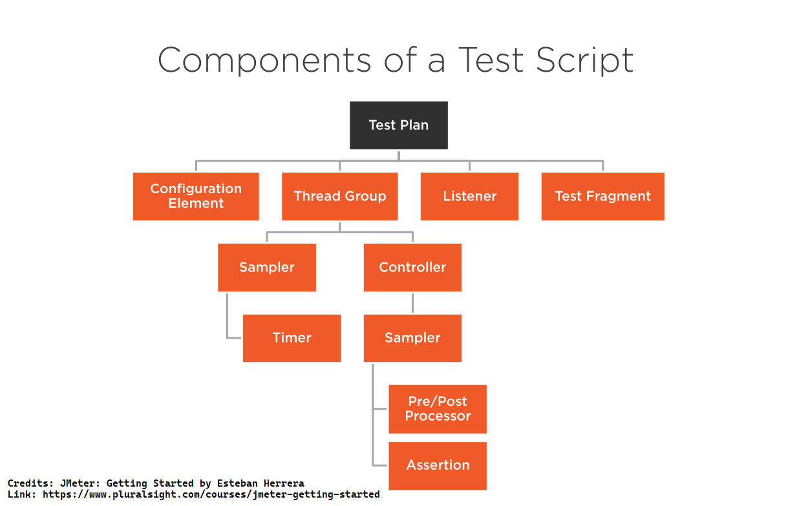
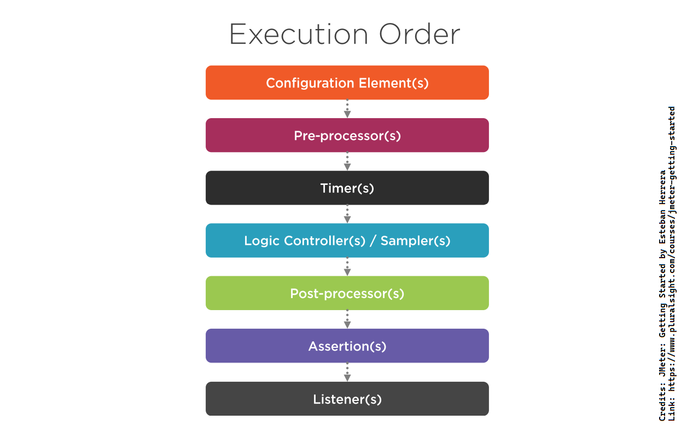

# JMeter - Getting Started by Esteban Herrera

## Description

> In this course, JMeter: Getting Started, you will learn the basics of this tool. First, you will explore performance testing and what JMeter can do. Next, you will see how to create tests with JMeter. Finally, you will discover how to collect and analyze test results.

[Course Link](https://www.pluralsight.com/courses/jmeter-getting-started)

### Performance testing metrics

- Response time
- Throughput
- Reliability
- Scalability

💡 *Identify the performance requirements of your application before you start performance testing your application. Don't forget to begin performance testing your application early in the development process.*

### Performance testing process

1. Design and build tests
2. Prepare the test environment
3. Run the tests
4. Analyze the results
5. Optimize
6. Retest

### Performance test types

- Smoke tests
- Load tests
- Stress tests
- Spike tests
- Endurance tests

💡 *JMeter is not a browser. It doesn't render HTML responses and execute JavaScript code. JMeter works at the protocol level simulating network requests.*

### Plugins

- Plugins are distributed as JAR files.

- How to install plugins? There are two ways to install the plugins.
	1. Place the plugin's JAR file in the **_JMeter-Home/lib/ext_** folder and restart JMeter(if it is running). JMeter automatically finds classes from the JAR files in the **_lib_** folder. The root **_lib_** folder in the JMeter installation folder is used for utility or dependency JAR files. The *J**Meter-Home/lib/ext*** folder is intended for JMeter components and plugins.
	2. Use the JMeter plugins Manager. You can download the JMeter plugins manager from [JMeter-Plugins.org - JMeter Plugins Manager](https://jmeter-plugins.org/wiki/PluginsManager/). To install it, download the JAR file of the Plugins manager and place it in the **_JMeter-Home/lib/ext_** folder. You can find the Plugins manager under the **_Options_** menu or click on the Plugins manager icon in the toolbar. You can install or remove plugins by ☑ or un ☑ the plugin in the **_JMeter plugins manager's Installed Plugins_** or **_Available Plugins_** tab.

- Helpful plugins
	- [Custom thread groups](https://jmeter-plugins.org/wiki/ConcurrencyThreadGroup/)
	- [3 basic graphs](https://jmeter-plugins.org/wiki/ResponseTimesOverTime/)
	- [Throughput shaping timer](https://jmeter-plugins.org/wiki/ThroughputShapingTimer/)
	- [Dummy sampler](https://jmeter-plugins.org/wiki/DummySampler/)

### Configuring a Test Plan

- ***setUp*** thread group is used to perform actions before JMeter start executing a regular thread group. ***tearDown*** thread group is run after the test has finished.

- Generally, ***Configuration Elements*** is used to set up default configurations, and variables for later use by other components. You can place ***Configuration Elements*** under any component and classify them into four types.
	1. Elements that allow us to define variables (CSV Data Set Config, Counter or Random Variable)
	2. Elements that allow us to define a configuration (JDBC Connection Configuration, Keystore Configuration or Login Config Element).
	3. Managers that allow us to manage configuration parameters (HTTP Header Manager, HTTP Cookie Manager or HTTP Cache Manager).
	4. Default configuration elements allow us to define the fill configurations for request types (HTTP Request Defaults, FTP Request Defaults, or Java Requests Defaults).

- ***Controllers*** are the children of the thread group.

 - ***Logic Controllers*** - Let you customize the logic to decide when to send requests (e.g. when a condition becomes true).

 - ***Samplers*** - Perform a request, generating one or more results.

- ***Timers*** allows you to introduce a delay between requests. Specifically, timers will introduce a delay before each sampler in their scope, simulating the time the user takes to perform an action on a web page and avoid overwhelming the server with an unrealistic load. ***Timers*** can be added at any level of the tree. ***Timers*** are only processed in conjunction with a sampler. If there are no samplers in the scope of a timer, they will not be executed.

 💡 *JMeter executes requests in sequence and without pauses.*

- ***Assertions*** allow you to validate a response is as expected. ***Assertions*** can be added at the ***Thread Group***, ***Controller*** or ***Sampler*** level, and they will apply to all the samplers in their scope.

 💡 ***Assertions*** like XPath, XML or HTML consumes a lot of resources.

 💡 If a ***Sub-sample*** assertion fails and the ***Main sample*** is successful, the main sample will be set to a failed status.

- JMeter collects information about the request it performs. ******_*Listeners*_****** provide access to that information by listening to responses and aggregating metrics.

 💡 ***Listeners*** can be added at any level. However, they will collect information only from the elements at or below their level.

 💡 All ***Listeners*** save the same data. The only difference is the way the data is presented.

 💡 ***Listeners*** can use a lot of memory.

- Components or elements of a ***Test Plan*** can be classified into two categories.
	1. Ordered - ***Controllers*** and ***Samplers***
	2. Hierarchical (scoped) - Everything else (***Configuration Elements***, ***Assertions***, ***Timers*** etc.)

- JMeter executes the elements of a ***Test Plan*** in the following order,

   💡 The last three are not executed if there is no server response. And ***Timers***, ***Assertions***,  ***Pre*** and ***Post-processors*** are only executed if there is a sampler to which they can be applied.

### Configuration elements rules
   
- The ***User Defined Variables*** configuration element is processed at the start of a test, no matter where it is placed.
   
- A ***Configuration Element*** inside a tree brach has higher precedence than another element of the same type in a outer branch.
	- Configuration default elements are merged, Managers are not(They are replaced by elements with high precedence).

- Elements are rearranged according to the order of execution.

- Outer elements are executed before inner elements of the same type.

- Some elements(such as ***Assertions*** and ***Timers***) are executed before or after each sampler in their scope.
	- If there is more than one element of the same type in the scope, all of them will be processed before(in the case of ***Timers***) or after(in the case of ***Assertions***) the samepler.

### Recording a Test

To be able to record a HTTPS application, you have to use JMeter's SSL certificate. It is generated when you start the test script recorder and placed in the ***JMeter_Home/bin*** folder(***JMeter_Home/bin/ApacheJMeterTemporaryRootCA.cert***). 

By default, the certificate is valid for 7 days. You can change the duration by setting the `proxy.cert.validity` property in the ***JMeter_Home/bin/jmeter.properties*** file. You will need to import the certificate to your browser as a Certificate Authority to record the requests.

#### Tips for recoding a test

- Use of the recording templates
- Apply a naming policy
- Plan how to manage static resources

💡 *In a real world performance test, it is recommended to run JMeter and the application under test in separate machines.*

💡 Use the GUI mode to create the test and CLI mode to run the test.

💡 *Before running the test in command line, it is recomended to disable all listeners. Also, in **Transaction Controllers**, it is recommended to uncheck the **Generate parent sample** option to get the most accurate results.* 

💡 ***APDEX** (Application Performance Index) measures user's satisfaction by taking into account the response time of the application.*

💡 *JMeter use properties to customize the HTML report generated for a test file. All these properties can be found in the **JMeter_Home/bin/reportgenerator.properties** file. It is recommended to copy the properties you like to customize to the **JMeter_Home/bin/user.properties** file and modify them.*

## Resources

- [Apache JMeter - User's Manual: Getting Started - Requirements](https://jmeter.apache.org/usermanual/get-started.html#requirements)
- [Apache JMeter - User's Manual: Getting Started - CLI Mode](https://jmeter.apache.org/usermanual/get-started.html#non_gui)
- [JMeter Plugins :: JMeter-Plugins.org](https://jmeter-plugins.org/)
- [Try jsoup](https://try.jsoup.org/)

## Tags

#jmeter #getting-started #performance-testing #load-testing #pluralsight #esteban-herrera
